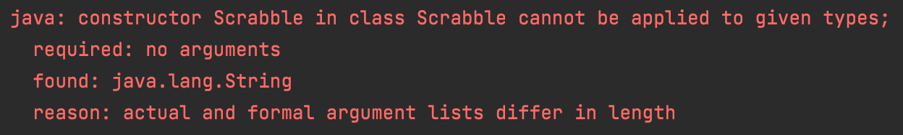

# Scrabble Challenge - this time in Java!

Welcome to the Scrabble challenge!

## Learning Objectives
- Build a simple program using functions, loops, and flow control
- Use `git` & GitHub to commit work and open a Pull Request

## Instructions

1. Fork this repository and then clone your copy:
```sh
$ git clone <YOUR GITHUB DETAILS>/scrabble-challenge.git && cd scrabble-challenge
```

2. Check your project set-up:
   1. Click on **File** then **Project Structure**
   2. Ensure that you have got the correct SDK selected (temurin-11)
   3. Ensure that the Language level is set to `SDK Default`
   4. Click **Apply**

3. Run the tests from IntelliJ. There should be a failing test to begin with. You can run your test suite in a few ways:
   1. Right-click on the project and then select `Run all Tests`
   2. Right-click on the `ScrabbleTest` and click `Run ScrabbleTest`
   3. Open the class file `ScrabbleTest` and click the "Play" button to the left of the class declaration

Your first error when running the tests should be this:



4. In GitHub, [open a Pull Request](https://docs.github.
   com/en/github/collaborating-with-issues-and-pull-requests/creating-a-pull-request) from your forked repository to the challenge repository.
5. Implement the criteria below locally and [push your code](https://docs.github.
   com/en/github/managing-files-in-a-repository/adding-a-file-to-a-repository-using-the-command-line) to your repository! Every push to a branch that has an open Pull Request will update it automatically with your changes.

# Task

Given a word, compute the scrabble score for that word.

##### Letter Values

You'll need these:

| Letter                        | Value  |
| ----                          |  ----  |
| A, E, I, O, U, L, N, R, S, T  |     1  |
| D, G                          |     2  |
| B, C, M, P                    |     3  |
| F, H, V, W, Y                 |     4  |
| K                             |     5  |
| J, X                          |     8  |
| Q, Z                          |     10 |

Example
"cabbage" should be scored as worth 14 points:

- 3 points for C
- 1 point for A, twice
- 3 points for B, twice
- 2 points for G
- 1 point for E

And to total:

```
3 + 2x1 + 2x3 + 2 + 1
= 3 + 2 + 6 + 3
= 14
```

## Acceptance Criteria

```java

class ScrabbleRunner {

   public static void main(String[] args) {
      Scrabble scrabble = new Scrabble("");
      scrabble.score();   // => 0

      scrabble = new Scrabble(null);
      scrabble.score();   // => 0

      scrabble = new Scrabble("a");
      scrabble.score(); // => 1

      scrabble = new Scrabble("f");
      scrabble.score(); // => 4

      scrabble = new Scrabble("street");
      scrabble.score(); // =>, 6

      scrabble = new Scrabble("quirky");
      scrabble.score(); // => 22

      scrabble = new Scrabble("OXYPHENBUTAZONE");
      scrabble.score(); // => 41
   }
}
```

## Extended Acceptance Criteria
> Each `Scrabble` method should be no more than 5 lines and contain no more than 5 operations.

> You can play a double or a triple letter.

> You can play a double or a triple word.

## Domain Models
### 1. Check if zero.
   >"As a player,<br/>
   I would like an empty word to return a score of 0,<br/>
   So that I need to play letters to score."<br/>
   
| Objects  | Properties     | Messages           | Output   |
|----------|----------------|--------------------|----------|
| Scrabble | score(@String) | workCheck(@String) | @Integer |

### 2. Check if null.
>"As a player,<br/>
I would like null to return a score of 0,<br/>
So that I need to play letters to score."<br/>

| Objects  | Properties     | Messages           | Output   |
|----------|----------------|--------------------|----------|
| Scrabble | score(@String) | workCheck(@String) | @Integer |

### 3. Check if individual letters score.
>"As a player,<br/>
I would like individual letters to score the correct value,<br/>
So that I can score the correct values."<br/>

| Objects  | Properties     | Messages                | Output   |
|----------|----------------|-------------------------|----------|
| Scrabble | score(@String) | calculateScore(@String) | @Integer |

### 4. Check if words score.
>"As a player,<br/>
I would like to return the correct score,<br/>
So that I can play scrabble correctly."<br/>

| Objects  | Properties     | Messages                | Output   |
|----------|----------------|-------------------------|----------|
| Scrabble | score(@String) | calculateScore(@String) | @Integer |

### 4. Check if case-insensitive words score.
>"As a player,<br/>
I would like to return a score for a case insensitive word,<br/>
So that I can play scrabble correctly."<br/>

| Objects  | Properties     | Messages           | Output   |
|----------|----------------|--------------------|----------|
| Scrabble | score(@String) | wordCheck(@String) | @Integer |

### 5. Check that double words score.
>"As a player,<br/>
I would like play words that score double,<br/>
So that I can play scrabble correctly."<br/>

| Objects  | Properties     | Messages                | Output   |
|----------|----------------|-------------------------|----------|
| Scrabble | score(@String) | calculateScore(@String) | @Integer |

### 6. Check that triple words score.
>"As a player,<br/>
I would like play words that score triple,<br/>
So that I can play scrabble correctly."<br/>

| Objects  | Properties     | Messages                | Output   |
|----------|----------------|-------------------------|----------|
| Scrabble | score(@String) | calculateScore(@String) | @Integer |

### 7. Check that a double letter in a word scores.
>"As a player,<br/>
I would like play words that score double letters,<br/>
So that I can play scrabble correctly."<br/>

| Objects  | Properties     | Messages                | Output   |
|----------|----------------|-------------------------|----------|
| Scrabble | score(@String) | calculateScore(@String) | @Integer |

### 8. Check that a triple letter in a word scores.
>"As a player,<br/>
I would like play words that score triple letters,<br/>
So that I can play scrabble correctly."<br/>

| Objects  | Properties     | Messages                | Output   |
|----------|----------------|-------------------------|----------|
| Scrabble | score(@String) | calculateScore(@String) | @Integer |